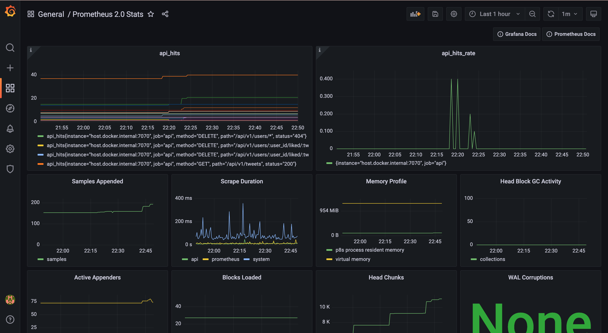

# Twitter Clone
[](https://circleci.com/gh/JamesHsu333/go-twitter/tree/main)
## Introduction
A Twitter clone created with Golang, PostgreSQL, Redis, VueJS, Vite and element-plus integrated Prometheus, Grafana and Jaeger.
# Using tech
## Frontend
- [NodeJS](https://nodejs.org/en/)
- [Vue 3](https://v3.vuejs.org/)
- [Vite 2.0](https://vitejs.dev/)
- [Vuex 4](https://next.vuex.vuejs.org)
- [Vue Router 4](https://next.router.vuejs.org)
- [Element Plus](https://element-plus.org/en-US/)

## Backend
- [Golang](golang.org)
- [echo](https://github.com/labstack/echo)
- [sqlx](https://github.com/jmoiron/sqlx)
- [pgx](https://github.com/jackc/pgx)
- [viper](https://github.com/spf13/viper)
- [go-redis](https://github.com/go-redis/redis)
- [zap](https://github.com/uber-go/zap)
- [lumberjack](gopkg.in/natefinch/lumberjack.v2)

## Database
- [PostgreSQL](postgresql.org)
- [Redis](redis.io)
- [migrate](https://github.com/golang-migrate/migrate)

## Monitor
- [Prometheus](https://prometheus.io/)
- [Grafana](https://grafana.com/)
- [Jaeger](https://www.jaegertracing.io/)
- [Opentelemetry](https://opentelemetry.io/)

## DevOps
- [Docker](https://www.docker.com/)
- [Docker Compose](https://docs.docker.com/compose/)
- [CircleCI](https://circleci.com/)

# Features
- [Clean Architecture](https://blog.cleancoder.com/uncle-bob/2012/08/13/the-clean-architecture.html)
- Metrics and alerting with Prometheus
- Monitor metrics with Grafana
- Monitor and troubleshoot transactions with Jaeger
- Backend features
```
- Users
    - Create User
    - Get User Info By User ID, User Name
    - Update User Info
    - Delete User
    - Search User By Name, Email, User Name
- Tweets
    - Create Tweet With Image
    - Get Tweet By Tweet ID, User ID (Author), Reply
    - Delete Tweet
- Like
    - Like Tweet
    - Get User-Liked Tweets
    - Get Liked-Tweet Users
    - Cancel Like Tweet
- Follow
    - Follow User
    - Get Followers Of User
    - Get Following Of User
    - Unfollow User
- Middleware
    - Role Management
    - Verify Admin or Owner
    - Verify CSRF token
    - Verify Session
- Log
    - Rolling Log Files Automatically
```
# Getting Started
``` shell
# Clone the project
git clone 

# Enter project directory
cd go-twitter

# Install dependencies
make tidy

# Run database environment by docker-compose
# Jaeger UI localhost:16686
# Prometheus UI localhost:9090
# Grafana UI localhost:3000
make local

# Run backend
make run

# Enter frontend directory
cd web/ui

# Install
yarn

# Run frontend
yarn run dev
```
# Monitoring
## Prometheus
http://localhost:9090

## Grafana
http://localhost:3001

## Jaeger
http://localhost:16686


# Preview

For more check out screenshots at `.github/screenshots`
# References
- [Twitter](https://twitter.com)
- [Twitter API reference](https://developer.twitter.com/en/docs/api-reference-index)
- [Twitter Clone](https://github.com/HotPotatoC/twitter-clone)
- [Clean Architecture](https://blog.cleancoder.com/uncle-bob/2012/08/13/the-clean-architecture.html)
- [Go Clean architecture rest api example](https://dev.to/aleksk1ng/my-first-go-rest-api-3bl3)